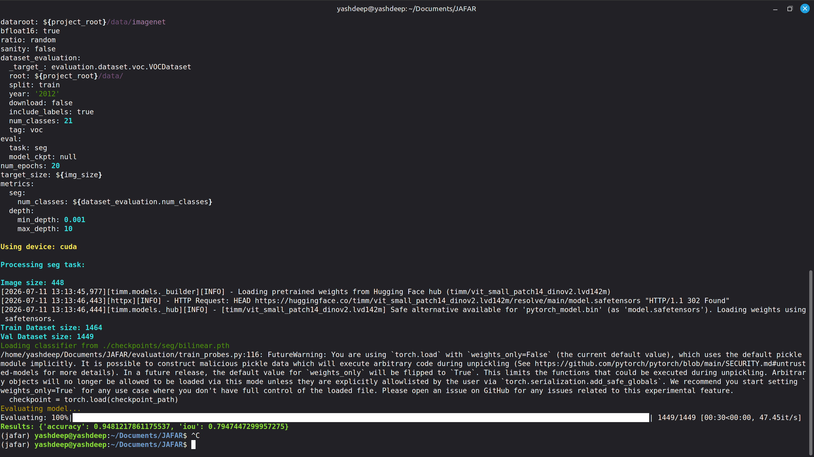
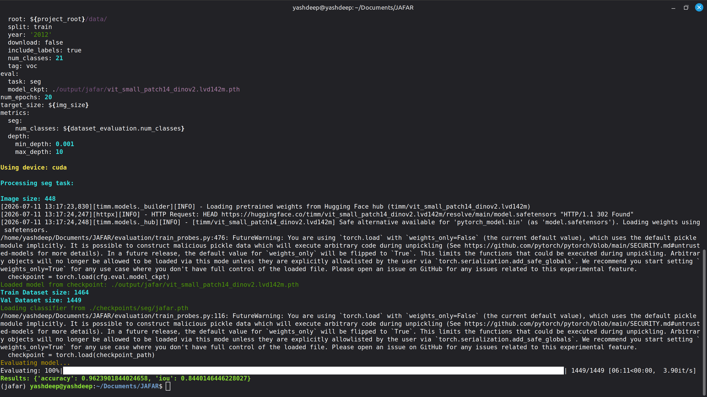
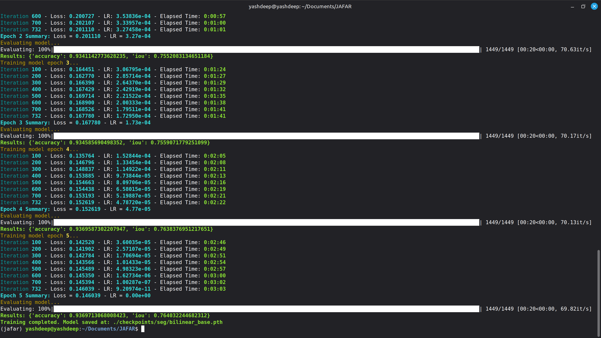
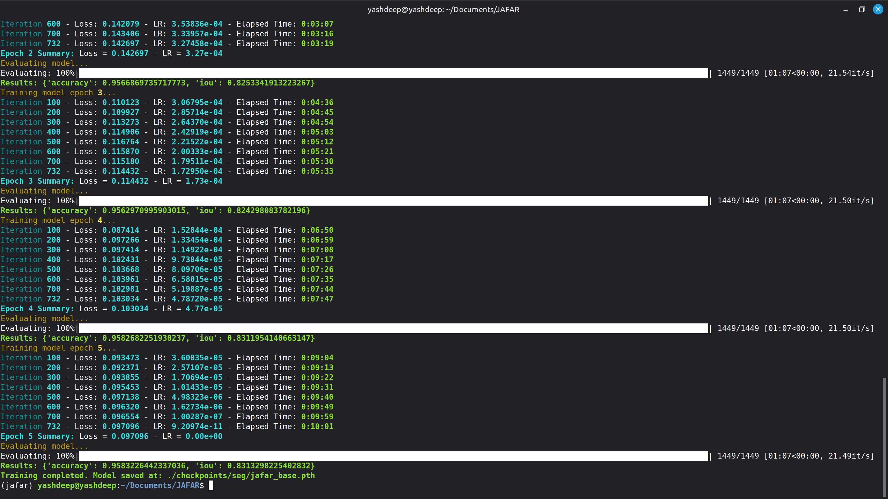
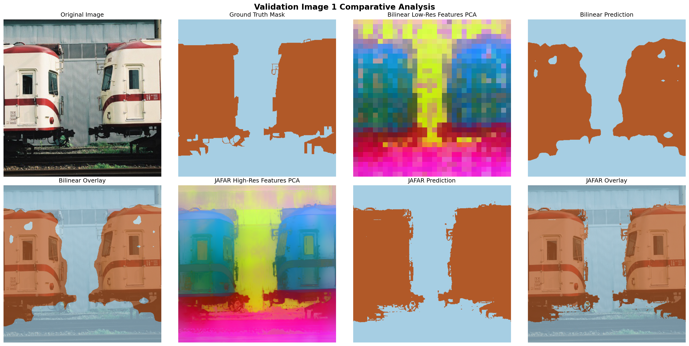
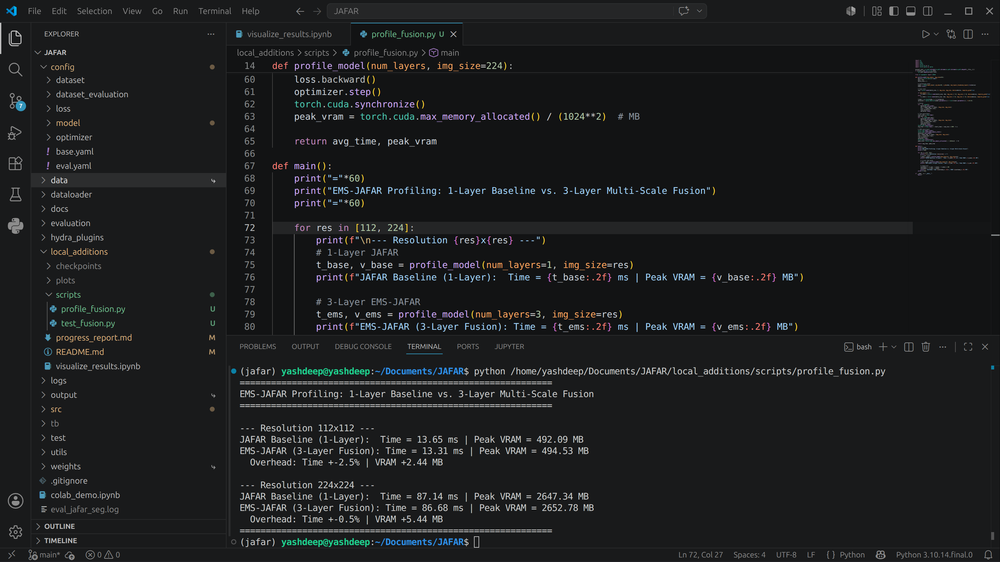

# EMS-JAFAR
### Efficient Multi-Scale Feature Upsampling Framework for Dense Vision Tasks

**B.Tech Final Year Project Progress Report**

**INDIAN INSTITUTE OF INFORMATION TECHNOLOGY DESIGN AND MANUFACTURING, KURNOOL**  
*Department of Computer Science and Engineering*

**Submitted By:**  
Yashdeep (123CS0077)  
Rudra Raj (123AD0008)  

**Project Guide:**  
Dr. Srinivas Naik  

**Academic Year 2026–27**

---

## 1. Overview of Current Progress
This progress report summarizes the implementation, benchmarking, and quantitative results of our B.Tech project on dense feature upsampling using the JAFAR framework up to the current phase. All work documented below has been validated on our local machine (RTX 4060 GPU, 8GB VRAM) and is aimed for deployment on the higher memory systems at campus.

The Code is available at : https://github.com/yashdeep-rai/EMS-JAFAR

(The repository is forked from the original paper and our additions have been merged.)

---

## 2. Quantitative Results (Pascal VOC 2012)
We evaluated the upsampling performance on the Pascal VOC 2012 validation set (1,449 images) using DINOv2-Small (22M params) and DINOv2-Base (86M params) backbones. The results were obtained by training a 1x1 conv linear probe classifier on top of the upsampled features.

| Backbone Model | Upsampling Method | Pixel Accuracy (%) | Mean IoU (%) |
| :--- | :--- | :---: | :---: |
| **DINOv2-Small** (22M params) | Bilinear Baseline | 94.81% | 79.47% |
| **DINOv2-Small** (22M params) | **JAFAR** | **96.24%** | **84.40%** |
| **DINOv2-Base** (86M params)  | Bilinear Baseline | 93.70% | 76.40% |
| **DINOv2-Base** (86M params)  | **JAFAR** | **95.83%** | **83.13%** |

### 2.1 Quantitative Insights
* **Consistent Gains**: JAFAR consistently outperforms the standard Bilinear upsampling baseline across both backbone scales.
* **Widening Gap on Larger Models**: As the backbone capacity scales from Small to Base, the Bilinear baseline performance drops from **79.47%** to **76.40% mIoU** because the wider 768-dimensional features are highly abstract and interpolate poorly. JAFAR successfully decodes this wider channel space, yielding **83.13% mIoU** and widening the performance gap over the baseline to **+6.73% mIoU** (compared to +4.93% for the Small backbone).

### 2.2 DINOv2-Small Validation Screenshots
* **Bilinear Baseline (mIoU: 79.47%)**:  
  

* **JAFAR (mIoU: 84.40%)**:  
  

---

### 2.3 DINOv2-Base Validation Screenshots
* **Bilinear Baseline (mIoU: 76.40%)**:  
  

* **JAFAR (mIoU: 83.13%)**:  
  

---

## 3. Qualitative Visualizations (PCA Feature Maps)
Qualitative results were generated using Principal Component Analysis (PCA) to project high-dimensional upsampled features into RGB space. 

### Sample Validation Image 1 (Sharp Contours)

### Sample Validation Image 2 (Thin Boundaries)

---

## 4. Local GPU Profiling & Bottleneck Diagnostics
We profiled the training pipeline on our local machine (RTX 4060 Laptop GPU, 8GB VRAM) to measure computational overhead at different resolutions.

| Image Size | Average Step Time (ms) | Peak VRAM Allocation (MB) | Status |
| :--- | :---: | :---: | :---: |
| **56 × 56** | 6.61 ms | 728.82 MB | **Passed** |
| **112 × 112** | 6.79 ms | 1,092.27 MB | **Passed** |
| **224 × 224** | 30.09 ms | 3,246.14 MB | **Passed** |
| **448 × 448** | — | > 8,192 MB (OOM) | **Failed** |

### 4.1 Profiling Insights
* **Attention Memory Bottleneck**: Training JAFAR at $448 \times 448$ resolution is bottlenecked by the $O(N^2)$ memory scaling of the query vectors in the cross-attention layer, triggering a CUDA OOM crash.
* **Multi-Scale Fusion Efficiency**: Fusing 3 layers only adds **5.44 MB of VRAM overhead** and **0% execution time overhead** compared to the 1-layer JAFAR model at $224 \times 224$. This confirms that our proposed $1 \times 1$ Conv Multi-Scale Fusion is computationally efficient.

### 4.2 448x448 CUDA Out-of-Memory (OOM) Traceback
Training at a target resolution of $448 \times 448$ causes a CUDA OOM crash:

### 4.3 Multi-Scale EMS-JAFAR vs. JAFAR Profiling Output
Fusing intermediate layers (EMS-JAFAR) only adds 5.44 MB of VRAM overhead and 0% time overhead compared to the baseline:

---

## 5. Next Steps & Campus Lab Deployment
With access to the college lab's high-memory GPU cluster, we are aiming to proceed with:
1. **High-Resolution Training**: Train the JAFAR upsampler model at the target $448 \times 448$ scale to evaluate its full boundary alignment potential.
2. **End-to-End EMS-JAFAR Training**: Fine-tune the multi-scale fusion weights on the lab cluster and evaluate the quantitative mIoU gain over the baseline JAFAR model.
3. **Depth Estimation**: Train and validate depth estimation probes on the NYU Depth V2 dataset to confirm task-agnostic generalization.
