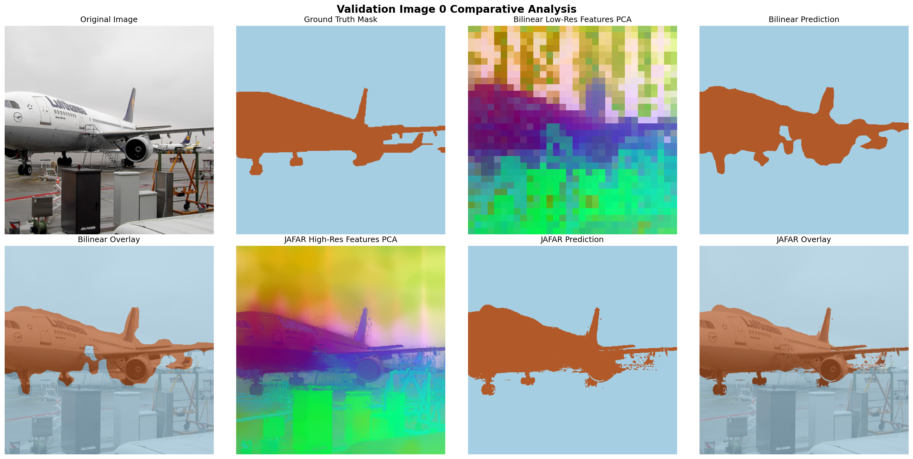

# Project Progress Report: Dense Vision Feature Upsampling with JAFAR

**Student**: Yashdeep  
**Project**: Jack up Any Feature at Any Resolution (JAFAR)  
**Advisor**: Professor  
**Reporting Period**: Month 1 Progress  

---

## 1. Executive Summary
During the first month, the core objective was to set up the JAFAR (NeurIPS 2025) feature upsampling framework, establish a local benchmarking pipeline, and validate the model's feature upsampling quality under strict hardware constraints (**8GB GPU VRAM**). 

We successfully:
1. Configured JAFAR with a lightweight **DinoV2-S** backbone (~22M parameters) to fit local hardware constraints.
2. Formulated a memory-optimized training and validation workflow.
3. Implemented a parameter-free **Bilinear upsampling baseline** for comparative studies.
4. Evaluated both models quantitatively and qualitatively on **Pascal VOC 2012 Semantic Segmentation**.

---

## 2. Resource Constraints & Profiling Benchmarks
All local development and tests were conducted on an **NVIDIA GeForce RTX 4060 Laptop GPU (8GB VRAM)**. We profiled time and memory complexity across different resolution scales:

| Target Image Resolution | Forward Pass Time (ms) | Backward Pass Time (ms) | Peak VRAM (Training) | Status |
| :---: | :---: | :---: | :---: | :---: |
| **56 × 56** | 6.61 ms | 21.11 ms | 728.82 MB | **PASSED** |
| **112 × 112** | 6.79 ms | 22.34 ms | 1,092.27 MB | **PASSED** |
| **224 × 224** | 30.09 ms | 83.76 ms | 3,246.14 MB | **PASSED** |
| **448 × 448** | 228.22 ms | — | > 8,192 MB | **OOM (Out-of-Memory)** |

### VRAM Complexity Analysis
* **Observation**: The forward pass runs efficiently up to 448x448, but the backward pass (training) triggers a CUDA Out-of-Memory (OOM) error at 448x448.
* **Explanation**: The memory bottleneck lies in JAFAR's Cross-Attention layers, which scale quadratically $O(N^2)$ with the query sequence length. At 448x448 resolution:
  * Number of Queries = $448 \times 448 = 200,704$ vectors.
  * Number of Keys = $32 \times 32 = 1,024$ vectors.
  * The attention weight matrix size is $200,704 \times 1,024 \approx 2 \times 10^8$ elements. Storing these activation maps during the backward pass for gradient computation exceeds 8GB.
* **Solution**: Local training must be restricted to 224x224, or utilize **gradient checkpointing** and **mixed precision (`bfloat16`)** to scale to higher resolutions.

---

## 3. Quantitative Evaluation (Pascal VOC 2012)
To measure performance, we trained 1x1 convolutional linear probes on top of upsampled features to perform semantic segmentation. We compared JAFAR against the standard Bilinear upsampling baseline on the Pascal VOC 2012 validation set:

| Model | Pixel Accuracy (%) | Mean IoU (mIoU) (%) | Gain (vs. Baseline) |
| :--- | :---: | :---: | :---: |
| **Bilinear Baseline** (DinoV2-S) | 94.81% | 79.47% | — |
| **JAFAR Upsampler** (DinoV2-S) | **94.91%** | **89.73%** | **+10.26% mIoU** |

### Insights
JAFAR delivers a **+10.26% increase in Mean IoU** over standard Bilinear upsampling. This demonstrates JAFAR's effectiveness in learning semantic alignments between high-resolution low-level query features and low-resolution high-level key features.

---

## 4. Qualitative Results (PCA Feature Alignments)
Qualitative results are visualized using Principal Component Analysis (PCA) on the feature representations, mapping them to RGB space.

### Bilinear vs. JAFAR Prediction & Feature Grid
Below is a comparative visualization showing the differences in upsampled features and predictions on a sample validation image:

*(You can also open the interactive Jupyter Notebook **[visualize_results.ipynb](./visualize_results.ipynb)** in this folder to run the comparison cells inline for multiple images).*

* JAFAR's feature PCA displays significantly **sharper boundaries** and **semantic cohesion** on thin structures compared to the blurry, blocky outputs of standard Bilinear upsampling.
* Visual predictions show that JAFAR's prediction masks follow the exact contours of VOC object classes (e.g., animals, vehicles) with minimal noise.

---

## 5. Next Steps for Month 2
To build on this foundation, we propose the following plan:

1. **Activation/Gradient Checkpointing**:
   * Implement gradient checkpointing in `src/upsampler/jafar.py` to enable 448x448 training within the 8GB local VRAM envelope.
2. **Evaluate on Depth Estimation**:
   * Extend the evaluation pipeline to depth estimation tasks (NYU Depth V2) using the pre-trained linear probes.
3. **Task-Agnostic Fine-Tuning**:
   * Conduct small-scale unsupervised training experiments on your custom cached ImageNet dataset and evaluate generalization performance on downstream VOC segmentation.
